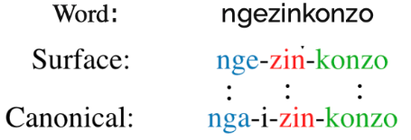

# MORPH_SEGMENT
## Morphological Segmentation of Low Resource South African Languages

 

## Project Team: Mr. Aaron Daniels, Mr. Tumi Moeng, Mr. Sheldon Reay
#### Project Supervisor: Dr. Jan Buys 

Repository containing three individual repositories using Machine Learning to the task of Morphological Segmentation of Low Resource South African Languages. The three models used are, Conditional Random Fields (CRFs), Sequence to Sequence Models (Seq2Seq), and finally, Unsupervised Machine Learning Models.

# Morphological Segmentation

Morphological Segmentation involves decomposing words into morphemes, the smallest meaning-bearing units of language. This is an important NLP task for morphologically-rich agglutinative languages such as the Southern African Nguni language group. In this paper, we investigate supervised and unsupervised models for two variants of morphological segmentation: canonical and surface segmentation. We train sequence-to-sequence models for canonical segmentation, where the underlying morphemes may not be equal to the surface form of the word, and Conditional Random Fields (CRF) for surface segmentation. In the unsupervised setting, an entropy-based approach using a character-level LSTM language model is used. We hope that the high performance of the supervised segmentation models will help to facilitate the development of better NLP tools for Nguni languages.

## Canonical and Surface Segmentation

Two types of segmentation were used:

<b>Surface segmentation:</b> a word `w` is segmented into a sequence of substrings. The concatenation of said substrings produces the original word `w`. 

<b>Canonical segmentation:</b> a word is analyzed and segmented into a sequence of canonical morphemes, where each canonical morpheme corresponds to a surface morpheme as its orthographic representation. 

  

## Running the Models

Within the repository there are saved models which can be loaded and and run to produce results which align with our findings.

--------------------------------------------------------------------
### Links:

Original Paper:
https://arxiv.org/abs/2104.00767

Website For Further Details:
https://projects.cs.uct.ac.za/honsproj/cgi-bin/view/2020/daniels_moeng_reay.zip/MORPH_SEGMENT/MORPH-SEGMENT.html
